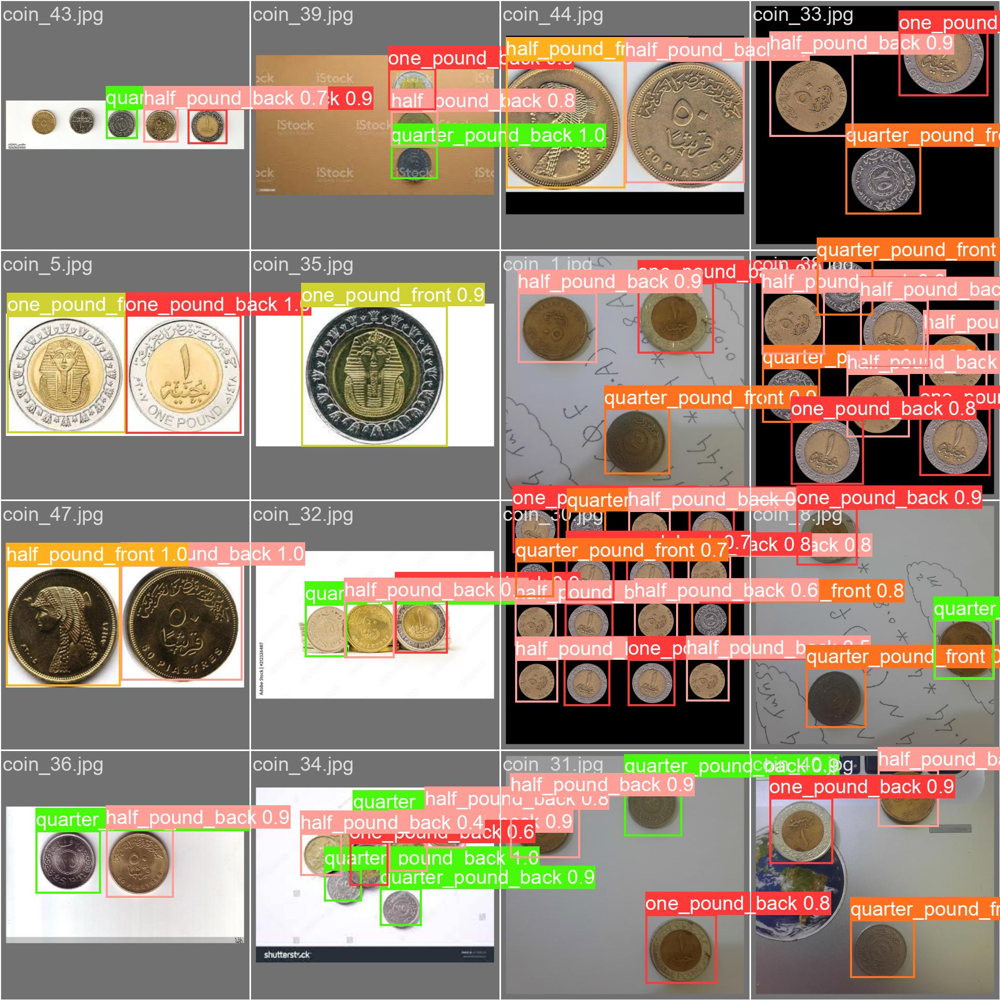
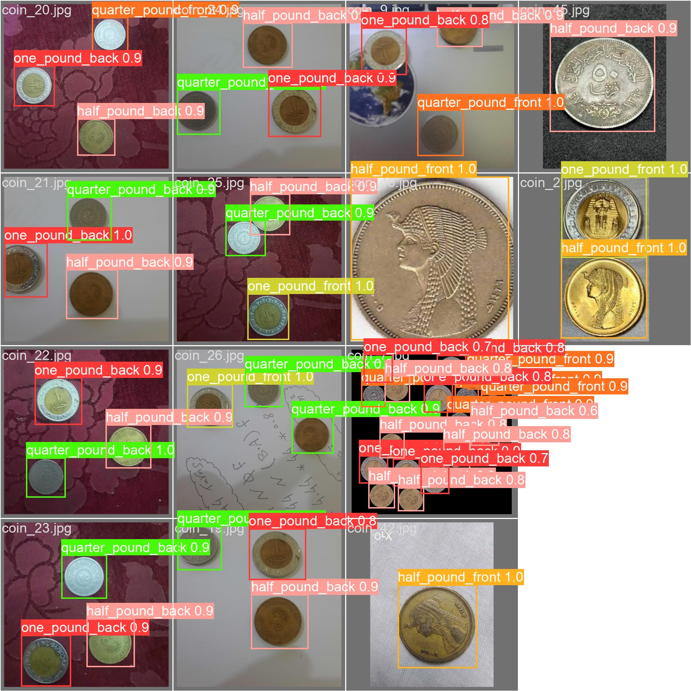

  

<h1 align="center">CoinDetector</h1>

<h3 align="center">YOLOv8-based Model for Egyptian Coin Detection and Classification</h3>

  <a href="#dataset">Dataset</a> •
  <a href="#model">Model</a> •
  <a href="#training">Training</a> •
  <a href="#results">Results</a> •
  <a href="#example-output">Example Output</a> •
  <a href="#license">License</a> •
  <a href="#acknowledgments">Acknowledgments</a>

---

  Welcome to CoinDetector, a state-of-the-art computer vision model designed for detecting and classifying Egyptian coins. This repository contains everything you need to get started with object detection and recognition tasks using our YOLOv8-based model.

  

## Dataset
- Explore the dataset used for training and testing our model in the [DataSetDrive_link.txt](DataSetDrive_link.txt) file.

## Model
- Access the YOLOv8 model architecture and pretrained weights in the [Model](Model) directory.

## Training
- Dive into the details of our training process and configuration in the [train2](train2) directory.

## Results
- Explore a wealth of results, including confusion matrices and captivating images, in the [train2](train2) directory.

## Example Output
- Behold an example of the incredible output generated by our model!

## License
- This project is licensed under the [IMT License](LICENSE).

## Acknowledgments
- We extend our gratitude to the following individuals and organizations for their invaluable contributions to this project.
